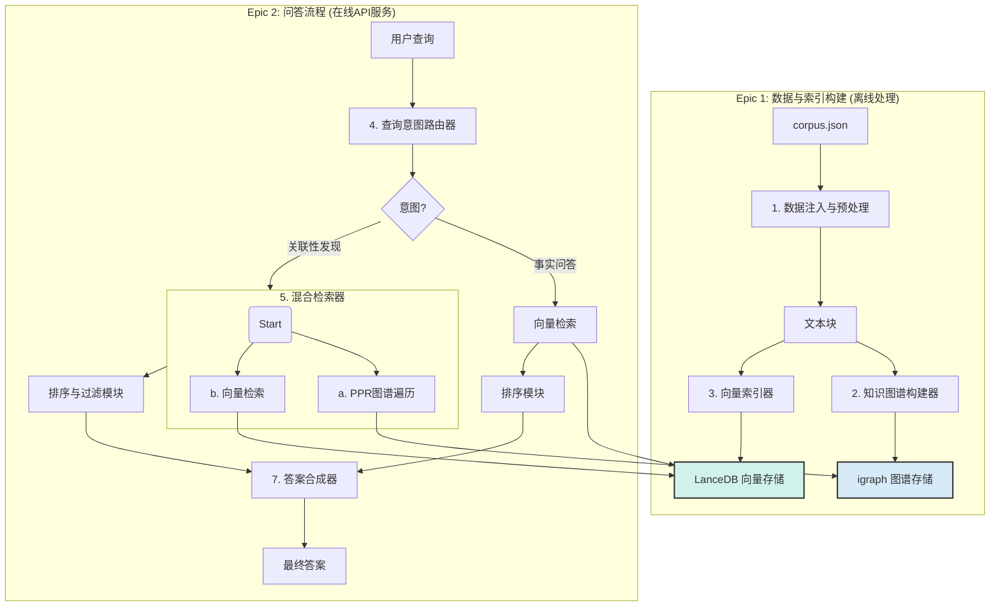

# **上市公司关联性RAG项目 - 棕地架构文档**

  * **版本**: 1.2 (最终版)
  * **日期**: 2025年7月5日
  * **作者**: Winston (Architect)
  * **状态**: **已批准 (Approved)**

## 1\. 架构概述与核心原则

### 1.1. 核心挑战与设计原则

本项目旨在对一个基于`hipporag`框架的原型进行“棕地”增强，以解决图谱构建不完整的问题，并引入现代化组件（如专用向量数据库、重排序模型）和双功能查询（事实问答+关联性发现）。

核心设计原则如下：

  * **封装与注入**: 将`hipporag`作为第三方库使用，不修改其源码。所有定制化功能（中文Prompt、新模型调用）都通过独立的“适配器”类来实现并注入流程中，以保证项目的可维护性和未来的可升级性。
  * **双存储核心**: 明确分离图谱存储和向量存储。利用`hipporag`内建高效的`igraph`处理图谱逻辑关系，同时引入专用的向量数据库`LanceDB`处理语义相似性，各司其职。
  * **测试驱动开发 (TDD)**: 所有由AI智能体实现的功能模块，都必须严格遵循TDD流程，确保代码质量和功能的稳定性。

### 1.2. 技术栈 (Technology Stack) - v1.1

此技术栈为项目的“官方指定物料清单”，所有开发必须严格遵守。

| 分类 (Category) | 技术/库 (Technology/Library) | 版本 (Version) | 用途 (Purpose) | 理由 (Rationale) |
| :--- | :--- | :--- | :--- | :--- |
| **主要语言** | Python | \~3.10 | 项目核心开发语言 | 生态丰富，AI/ML领域首选 |
| **包管理器** | **uv** | **\~0.7.19** | 高性能Python包和项目管理 | 用户指定，比pip快10-100倍，现代且高效 |
| **核心框架** | HippoRAG | **\~2.0.0a4** | 提供图谱RAG的基础流程和能力 | 用户指定的核心框架，我们在此基础上进行增强 |
| **图谱库** | python-igraph | **\~0.11.9** | 高效的图谱计算，尤其是PPR | HipporAG作者推荐，性能高效 |
| **向量存储** | LanceDB | **\~0.24.0** | 存储和检索文本嵌入向量 | 轻量级、文件型、无需独立部署，与项目私有化目标一致 |
| **LLM调用** | Transformers | **\~4.42.0** | 加载和运行开源大语言模型 | 行业标准，支持广泛的模型 |
| **LLM (问答/过滤)** | **DeepSeek V3** | latest | 意图识别、事实过滤、答案生成 | 用户指定的高质量对话模型 |
| **嵌入模型调用**| Sentence Transformers | **\~3.0.1** | 加载和运行嵌入模型 | 简化嵌入模型调用的标准库 |
| **嵌入模型** | Qwen/Qwen3-Embedding-4B | latest | 将文本块转换为向量 | 用户指定的高性能中英文嵌入模型 |
| **重排序模型** | Qwen/Qwen3-Reranker-4B| latest | 对检索结果进行精确排序 | 用户指定的高性能重排序模型 |
| **测试框架** | Pytest | **\~8.2.2** | 自动化单元测试和集成测试 | 功能强大，社区支持广泛，适合TDD流程 |

## 2\. 核心架构组件与交互流程

### 2.1. 组件定义

系统由七个核心逻辑组件构成，这些组件将在`src/components/`目录下实现：

1.  **数据注入与预处理模块 (Data Ingestor & Preprocessor)**: 负责读取和准备`corpus.json`数据。
2.  **知识图谱构建器 (Knowledge Graph Constructor)**: 调用`hipporag`和LLM适配器，完成NER和RE，构建`igraph`图谱。
3.  **向量索引器 (Vector Indexer)**: 调用嵌入适配器和`LanceDB`，完成文本向量化和索引。
4.  **查询意图路由器 (Query Intent Router)**: 分析用户查询，分发到不同处理流程。
5.  **混合检索器 (Hybrid Retriever)**: 执行PPR图谱遍历和向量检索，进行初步召回。
6.  **排序与过滤模块 (Rank & Filter Module)**: 调用重排序和LLM适配器，对召回结果进行精炼。
7.  **答案合成器 (Answer Synthesizer)**: 调用LLM适配器，生成最终的结构化或文本答案。

### 2.2. 组件交互流程图



## 3\. 统一项目结构 (Source Tree)

```plaintext
a_share_rag_project/
│
├── 📜 pyproject.toml         # 项目元数据和uv配置
├── 📜 requirements.txt         # (由uv管理) 项目依赖库
├── 📜 uv.lock                  # (由uv管理) 锁定依赖版本
│
├── 📂 .github/                # GitHub Actions CI/CD 工作流
│   └── 📂 workflows/
│       ├── 📄 ci.yaml          # 持续集成工作流
│       └── 📄 cd.yaml          # 持续部署工作流
│
├── 📂 .env.example            # 环境变量模板，用于存放API密钥等敏感信息
│
├── 📂 config/                  # 存放所有配置和Prompt模板
│   ├── 📄 prompts.yaml          # 将所有prompt集中存放于此
│   └── 📄 settings.py          # (使用Pydantic-Settings)加载环境变量和配置
│
├── 📂 data/                    # 原始数据
│   └── 📄 corpus.json          # A股上市公司数据
│
├── 📂 output/                  # 所有生成的数据资产存放处
│   ├── 📂 graph/              # 存放生成的igraph图谱文件
│   └── 📂 vector_store/       # 存放LanceDB向量数据库文件
│
├── 📂 src/                     # 项目核心源码
│   │
│   ├── 📂 adapters/           # 与第三方库交互的适配器
│   │   ├── 📄 __init__.py
│   │   ├── 📄 llm_adapter.py     
│   │   ├── 📄 embedding_adapter.py 
│   │   └── 📄 reranker_adapter.py  
│   │
│   ├── 📂 components/         # 七大核心组件的实现
│   │   ├── 📄 __init__.py
│   │   └── ... (7个组件的.py文件)
│   │
│   ├── 📂 server/             # 在线查询API服务 (使用FastAPI)
│   │   └── 📄 main.py            # API服务入口
│   │
│   └── 📄 pipeline.py            # 离线数据处理与索引构建的流程脚本
│
├── 📂 notebooks/               # 人类监督者用于实验、分析和验证的Jupyter Notebooks
│
└── 📂 tests/                   # 自动化测试
    ├── 📂 unit/               # 单元测试
    ├── 📂 integration/        # 集成测试
    └── 📄 conftest.py         # Pytest的配置文件
```

## 4\. AI开发工作流与交付标准

### 4.1. 强制性TDD工作流 (Mandatory TDD Workflow)

AI开发智能体在执行任何编码任务时，必须严格遵循以下步骤：

1.  **创建失败测试**: 在编写功能代码前，先在`tests/`目录下编写一个会失败的测试用例。
2.  **编写最小实现**: 在`src/`目录下编写最少量的、仅足以让测试通过的代码。
3.  **确认测试通过**: 再次运行测试，确保其成功通过。
4.  **代码重构与文档**: 在测试的保护下，对代码进行重构，提升代码质量和可读性。

### 4.2. 完成的定义 (Definition of Done)

一个开发故事被视为“完成”，必须满足以下所有条件：

  * 所有相关的功能代码和测试代码已提交到代码库。
  * 所有在故事文件中定义的测试必须在CI流程中**100%通过**。
  * AI开发智能体必须在故事文件的`Dev Agent Record`部分填写其**完成笔记**。
  * 代码必须通过代码格式化工具（如`ruff format`）的检查。

## 5\. CI/CD (持续集成/持续部署) 策略

### 5.1. 平台选择

  * **平台**: **GitHub Actions**
  * **理由**: 与代码仓库无缝集成，生态丰富，配置简单。

### 5.2. 持续集成 (CI) 工作流

  * **触发条件**: 对任意分支的`push`或对`main`分支的`pull request`。
  * **核心目标**: 验证代码质量和功能的正确性。
  * **步骤**: 检出代码 -\> 设置环境 -\> 安装依赖 -\> 代码规范检查 -\> 运行测试。

### 5.3. 持续部署 (CD) 工作流

  * **触发条件**: 成功合并到`main`分支。
  * **核心目标**: 自动化部署并更新数据资产。
  * **步骤**:
    1.  **最终验证**: 完整运行CI流程。
    2.  **离线数据管道**: 运行`src/pipeline.py`，生成最新的图谱和向量库，并发布到持久化存储。
    3.  **在线API服务**: 将FastAPI服务打包成Docker镜像，推送到镜像仓库，并触发应用服务平台的更新。

## 6\. 架构风险与缓解策略

### 6.1. 风险：双存储数据同步失败

  * **潜在问题**: 离线索引时，图谱存储和向量存储的写入任务可能只有一个成功，导致数据状态不一致。
  * **架构缓解策略**: 采用“**暂存与发布 (Staging & Promotion)**”机制。离线管道先将数据写入临时目录，只有当所有写入任务都成功完成后，再通过一个原子操作将其更新为生产数据。

### 6.2. 风险：实时PPR算法的性能瓶颈

  * **潜在问题**: 在图谱规模和密度增大后，实时PPR计算可能成为查询时的性能瓶颈。
  * **架构缓解策略**: 引入**离线预计算与缓存**。对于PPR计算，可以在离线阶段为重要节点预先计算好Top N关联实体并缓存。在线查询时优先查找缓存。

### 6.3. 风险：适配器模式的脆弱性

  * **潜在问题**: 核心架构假设`hipporag`有清晰的接口可供“注入”我们自己的适配器。
  * **架构缓解策略**: 将开发计划的第一个故事设置为“**技术验证故事 (Spike Story)**”，其唯一目标就是编写最小测试代码，验证将一个自定义模块注入`hipporag`的可行性，从而在项目早期验证核心架构假设。