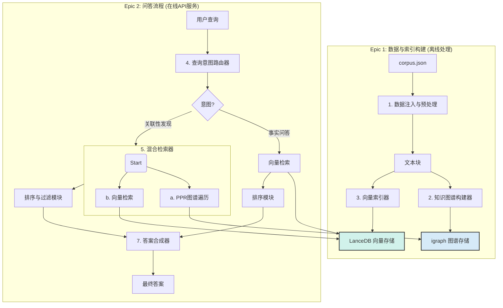

# 2\. 核心架构组件与交互流程

## 2.1. 组件定义

系统由七个核心逻辑组件构成，这些组件将在`src/components/`目录下实现：

1.  **数据注入与预处理模块 (Data Ingestor & Preprocessor)**: 负责读取和准备`corpus.json`数据。
2.  **知识图谱构建器 (Knowledge Graph Constructor)**: 调用`hipporag`和LLM适配器，完成NER和RE，构建`igraph`图谱。
3.  **向量索引器 (Vector Indexer)**: 调用嵌入适配器和`LanceDB`，完成文本向量化和索引。
4.  **查询意图路由器 (Query Intent Router)**: 分析用户查询，分发到不同处理流程。
5.  **混合检索器 (Hybrid Retriever)**: 执行PPR图谱遍历和向量检索，进行初步召回。
6.  **排序与过滤模块 (Rank & Filter Module)**: 调用重排序和LLM适配器，对召回结果进行精炼。
7.  **答案合成器 (Answer Synthesizer)**: 调用LLM适配器，生成最终的结构化或文本答案。

## 2.2. 组件交互流程图

